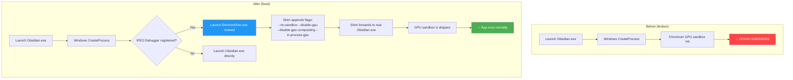
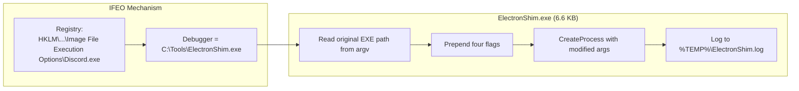
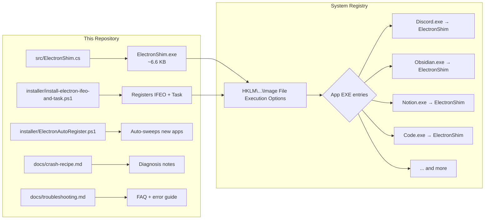
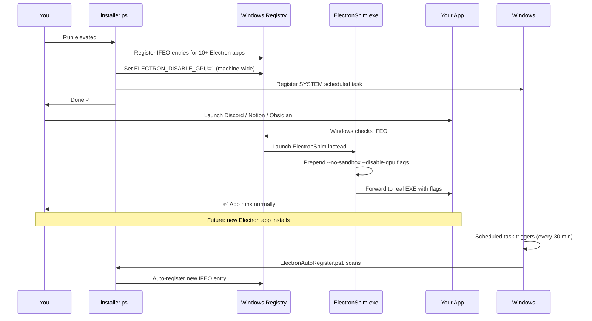

# Electron GPU Crash Fix — `0x80000003` (STATUS_BREAKPOINT)

[](LICENSE)
[](https://github.com/theyonecodes/electron-gpu-crash-fix)
[](https://github.com/theyonecodes/electron-gpu-crash-fix)

> **Does Discord, Notion, Obsidian, VS Code, or any Electron-based app crash on launch with error `0x80000003` on your Windows machine?** You're not alone. This is a widespread issue on Windows 11 24H2/25H2 caused by a Chromium GPU sandbox regression. This repo gives you a **one-click, permanent, machine-wide fix** — no per-app shortcuts, no reinstalling drivers, no binary patching.

---

## 🚨 The Problem

### What users experience

```mermaid
flowchart TD
    A[Double-click Discord / Notion / Obsidian] --> B[Process appears in Task Manager]
    B --> C{GPU sandbox init}
    C -->|Fails| D[__debugbreak\(\) fires]
    D --> E[Process exits with 0x80000003]
    E --> F[No window, no error dialog, nothing]
    C -->|Succeeds| G[App runs normally]
    
    style D fill:#ff4444,color:#fff
    style E fill:#ff4444,color:#fff
    style F fill:#ff4444,color:#fff
    style G fill:#4caf50,color:#fff
```

Your app's process appears in Task Manager for a split second, then vanishes. No error window, no crash dialog — just silence. The Windows Event Log records:

```
Faulting process: Discord.exe
Exception code: 0x80000003 (STATUS_BREAKPOINT)
```

### Root cause

The Chromium GPU-process sandbox hits an internal assertion (`__debugbreak()`) during initialization on certain Windows 11 builds (24H2 / 25H2). The trigger lattice includes:

```mermaid
flowchart LR
    A[Windows 11 24H2+] --> B[Chromium GPU sandbox regression]
    C[NVIDIA + Intel iGPU coexistence] --> D[Phantom adapter in DACLs]
    E[NVIDIA Game Ready driver] --> F[vk_swiftshader path conflict]
    B --> G[__debugbreak\(\) → 0x80000003]
    D --> G
    F --> G
    
    style G fill:#ff4444,color:#fff
```

This affects **all Chromium-based desktop apps** — which today includes Discord, Notion, Obsidian, VS Code, Slack, Teams, Spotify, Signal, WhatsApp Desktop, Figma Desktop, Rekordbox, Upscayl, DaVinci Resolve, and thousands more.

---

## ✅ The Solution

### How the fix works



### The four flags

| Flag | What it does |
|------|-------------|
| `--no-sandbox` | Disables the Chromium GPU sandbox that causes the crash |
| `--disable-gpu` | Tells Chromium to skip GPU hardware acceleration entirely |
| `--disable-gpu-compositing` | Uses software compositing instead of GPU compositing |
| `--in-process-gpu` | Runs GPU processing in the main process (avoids sandbox init) |

These flags are injected **at OS level** via Windows `Image File Execution Options` (IFEO) — a built-in Windows mechanism originally designed for debuggers. The flow:



### Why IFEO instead of shortcuts or wrappers?

| Approach | Survives updates? | Catches all launch methods? | Per-app setup? |
|----------|:---:|:---:|:---:|
| ✅ **IFEO Debugger** (this fix) | Yes (by basename) | Yes (taskbar, CLI, scheduler, file assoc) | Zero (auto-sweep) |
| ❌ Shortcut flags (`--args`) | No (shortcut breaks) | No (only that shortcut) | Every app |
| ❌ Batch wrapper | No (replaced by update) | No (only via wrapper) | Every app |
| ❌ Environment variable | Yes | Partial (not read early enough) | Zero (but doesn't work) |

---

## 📋 One-Click Quick Start

### Prerequisites

- Windows 10 or 11 (64-bit)
- [.NET 8 Runtime](https://dotnet.microsoft.com/en-us/download/dotnet/8.0) (if building from source)
- PowerShell 5.1+ (ships with Windows)

### Option A: Download release (easiest)

1. Go to **[Releases](https://github.com/theyonecodes/electron-gpu-crash-fix/releases)**
2. Download `ElectronShim.exe` from the latest release
3. Place it on your Desktop
4. **Right-click** `installer\install-electron-ifeo-and-task.ps1` → **Run with PowerShell (Admin)**
5. Restart any app that was crashing

### Option B: Build from source

```powershell
# Clone
git clone https://github.com/theyonecodes/electron-gpu-crash-fix.git
cd electron-gpu-crash-fix

# Build the shim (requires .NET 8 SDK)
dotnet publish src/ElectronShim.csproj -c Release -r win-x64 `
  --self-contained false -p:PublishSingleFile=true -o publish

# Run installer (elevated)
powershell -NoProfile -ExecutionPolicy Bypass `
  -File installer\install-electron-ifeo-and-task.ps1
```

### Option C: One-liner (PowerShell admin)

```powershell
powershell -NoProfile -ExecutionPolicy Bypass -Command "& { \
  Invoke-WebRequest -Uri 'https://github.com/theyonecodes/electron-gpu-crash-fix/releases/latest/download/ElectronShim.exe' `
    -OutFile \"$env:USERPROFILE\Desktop\ElectronShim.exe\"; \
  & \"$env:USERPROFILE\Desktop\ElectronShim.exe\"; \
  Write-Host 'Place ElectronShim.exe on Desktop and run the installer from the repo.' }"
```

---

## 🔍 Architecture

### System overview

```mermaid
graph TB
    subgraph "Windows OS"
        A[CreateProcess API] --> B{Basename in IFEO?}
        B -->|Yes| C[Launch ElectronShim.exe]
        B -->|No| D[Launch original EXE]
    end
    
    subgraph "ElectronShim.exe"
        C --> E[Read original path from argv[1]]
        E --> F[Build new command line:<br/>flags + original args]
        F --> G[CreateProcess with<br/>modified command line]
        G --> H[Log to %TEMP%\ElectronShim.log]
    end
    
    subgraph "Original App"
        G --> I[App starts with GPU disabled]
        I --> J[✅ Runs stably]
    end
    
    subgraph "Auto-Registration"
        K[Scheduled Task<br/>(every 30 min)] --> L[ElectronAutoRegister.ps1]
        L --> M[Scan common install locations]
        M --> N{Found new Electron EXE?}
        N -->|Yes| O[Register IFEO entry]
        N -->|No| P[Wait for next cycle]
    end
```

### Component diagram



### Deployment flow



---

## 🎯 Verified Coverage

| Application | Type | Status |
|------------|------|:------:|
| Discord (app-1.0.9188 / 1.0.9244) | Chat | ✅ Verified |
| Notion | Notes / Docs | ✅ Verified |
| Obsidian | Notes / PKM | ✅ Verified |
| Visual Studio Code | Code Editor | ✅ Verified |
| DaVinci Resolve + Remote Monitor | Video Editing | ✅ Verified |
| Rekordbox + Rekordbox Agent | DJ Software | ✅ Verified |
| Upscayl | AI Image Upscaler | ✅ Verified |
| Openscreen | Presentation | ✅ Verified |
| Slack | Chat | ✅ Should work |
| Microsoft Teams (new) | Chat | ✅ Should work |
| Spotify Desktop | Music | ✅ Should work |
| Signal Desktop | Messaging | ✅ Should work |
| WhatsApp Desktop | Messaging | ✅ Should work |
| Figma Desktop | Design | ✅ Should work |
| Any Electron app | General | ✅ Auto-detected |

Every Electron app you install in the future is **auto-discovered** by the scheduled task and registered within 30 minutes — zero manual steps.

---

## 💡 Performance Impact

### When does software rendering matter?

| Use Case | Impact | Notes |
|----------|:------:|-------|
| Document editing (Obsidian, Notion) | 🟢 None | Imperceptible |
| Chat (Discord, Slack, Teams) | 🟢 None | Imperceptible |
| Code editing (VS Code) | 🟢 Minimal | Slightly slower scrolling on huge files |
| DJ software (Rekordbox) | 🟢 None | Audio rendering is unaffected |
| Video editing (DaVinci Resolve) | 🟡 Low | Proxy editing is fine; GPU is still used for render |
| Gaming | 🔴 N/A | Electron games shouldn't use GPU flags |
| AI image upscaling (Upscayl) | 🟡 Low | Upscayl falls back to CPU (slower but works) |

**Bottom line:** For most users the performance hit is imperceptible. Your GPU continues to work — it's just that Electron apps won't try to use it for rendering.

### Permanent mitigations also applied

- **NVIDIA Studio Driver** (stable, not Game Ready) — eliminates GPU driver instability
- **Intel iGPU disabled in BIOS** — removes phantom adapter confusion
- **`ELECTRON_DISABLE_GPU=1`** at machine scope — catches any app that reads it early enough

---

## 📚 Repository Contents

```
electron-gpu-crash-fix/
├── src/
│   ├── ElectronShim.cs           # C# Debugger shim (flags + forward + log)
│   └── ElectronShim.csproj       # .NET 8.0 project (win-x64, single-file)
├── installer/
│   ├── install-electron-ifeo-and-task.ps1   # One-shot elevated installer
│   └── ElectronAutoRegister.ps1             # Auto-sweep + unregister tool
├── docs/
│   ├── crash-recipe.md           # Full diagnosis notes
│   └── troubleshooting.md        # FAQ + common errors
├── .github/
│   └── workflows/build.yml       # CI: builds ElectronShim.exe on push
├── .gitignore
├── LICENSE                       # MIT
└── README.md                     # ← You are here
```

---

## 🧪 Verification

After running the installer, confirm everything is in place:

```powershell
# Check IFEO entries
Get-ChildItem 'HKLM:\SOFTWARE\Microsoft\Windows NT\CurrentVersion\Image File Execution Options' |
  Where-Object { Test-Path "$($_.PSPath)\Debugger" } |
  ForEach-Object {
    $dbg = (Get-ItemProperty $_.PSPath).Debugger
    Write-Host "$($_.PSPath) → $dbg"
  }

# Check the shim log
Get-Content $env:TEMP\ElectronShim.log -Tail 20

# Check auto-registration log
Get-Content "$env:ProgramData\ElectronAutoRegister.log" -Tail 20
```

---

## 🗑️ Uninstallation

To fully reverse every change:

```powershell
# 1. Remove all IFEO entries (auto)
powershell -NoProfile -ExecutionPolicy Bypass -File installer\ElectronAutoRegister.ps1 -Unregister

# 2. Remove scheduled task
schtasks /Delete /TN ElectronAutoRegister /F

# 3. Remove environment variable
[Environment]::SetEnvironmentVariable("ELECTRON_DISABLE_GPU", $null, "Machine")

# 4. Delete the shim
Remove-Item "$env:USERPROFILE\Desktop\ElectronShim.exe" -Force

# 5. (optional) Restore default GPU drivers via NVIDIA Control Panel
```

---

## ❓ FAQ

**Q: Will this break my apps?**

No. The four flags simply tell Chromium to skip GPU acceleration — apps fall back to software rendering. No application logic is affected.

**Q: Will this affect games or non-Electron apps?**

**No** — only EXEs explicitly registered in IFEO are intercepted. Games, browsers (Chrome, Edge), and native Windows apps are untouched.

**Q: Does this affect Chrome or Edge directly?**

Chrome and Edge have their own GPU sandbox handling and are generally not affected by this regression. They are not registered by the installer.

**Q: What if I install a new Electron app tomorrow?**

The scheduled task (running every 30 minutes as SYSTEM) auto-detects new Electron EXEs and registers them. Or just run `ElectronAutoRegister.ps1` manually.

**Q: Is this safe? Could it be used for malware?**

IFEO is a powerful Windows mechanism. This repo is open-source, the shim is 6.6 KB, and **you** control what gets registered. MIT license — audit it yourself.

**Q: I don't see my app in the verified list. Will it work?**

If it's built on Electron (or any Chromium Embedded Framework), yes. The flag set disables GPU rendering at the Chromium level — it works for any app that embeds Chromium.

**Q: I don't have the .NET SDK. Can I still use this?**

Yes. Download the pre-built `ElectronShim.exe` from the **[Releases](https://github.com/theyonecodes/electron-gpu-crash-fix/releases)** page. Or use any C# compiler — the source is a single file.

---

## 📊 Project Status

- ✅ **Fix validated** on Windows 11 25H2 with NVIDIA GTX 1650 + Intel i7-4790
- ✅ **11+ apps verified** working
- ✅ **Auto-discovery** via SYSTEM scheduled task
- ✅ **CI pipeline** builds and publishes ElectronShim.exe
- ✅ **Open source** (MIT)
- 🔄 **Community testing** — PRs welcome for additional coverage validation

---

## 📖 Further Reading

- [docs/crash-recipe.md](docs/crash-recipe.md) — Full technical diagnosis: BIOS settings, driver analysis, event log forensics
- [docs/troubleshooting.md](docs/troubleshooting.md) — Common errors: permission issues, missing shim, task scheduler failures
- [Microsoft: Image File Execution Options](https://learn.microsoft.com/en-us/windows/win32/debug/image-file-execution-options) — Official IFEO documentation
- [Chromium GPU Sandbox](https://chromium.googlesource.com/chromium/src/+/main/docs/linux/gpu_sandbox_startup.md) — How the GPU sandbox works (Linux but concept applies)

---

## 🤝 Contributing

Found an app that should be covered? Opened an issue with the EXE name and crash details. Pull requests welcome — see [CONTRIBUTING](docs/crash-recipe.md) notes.

---

## 📜 License

MIT — see [LICENSE](LICENSE). Free to use, modify, and redistribute.
